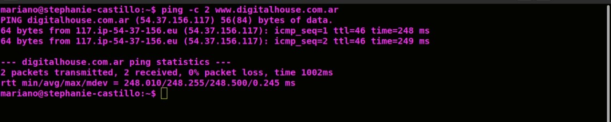

# Informe de entrega 3.

* ping: ping -c 2 www.digitalhouse.com.ar

 

* su root

*  git --version

## PREGUNTAS: 

* ¿Por qué un lenguaje de programación sólo puede utilizarse en algunos sistemas operativos y en otros no?. 

    Al momento de ejecutarse un programa es portable cuando tiene la capacidad de poder ejecutarse en una plataforma, ya sea hardware o software, diferente a aquella en la que se elaboró. La portabilidad es una característica muy deseable para un programa, ya que permite, por ejemplo, a un programa que se ha desarrollado para sistemas GNU/Linux ejecutarse también en la familia de sistemas operativos Windows.

* ¿Qué tipo de máquina virtual es virtualBox?.

    VirtualBox es una aplicación que sirve para hacer máquinas virtuales con instalaciones de sistemas operativos. Esto quiere decir que si tienes un ordenador con Windows, GNU/Linux o incluso macOS, puedes crear una máquina virtual con cualquier otro sistema operativo para utilizarlo dentro del que estés usando.

* Si tengo más de una máquina virtual instalada, y una se rompe, ¿esto afecta a las demás? ¿por qué?

    Si tengo mas de una maquina virtual en mi virtualBox, y decido "romperla", esto no afecta a las otras ya que estas viven en imagenes distintas.

* Sacar una captura de pantalla de los commits hechos:

