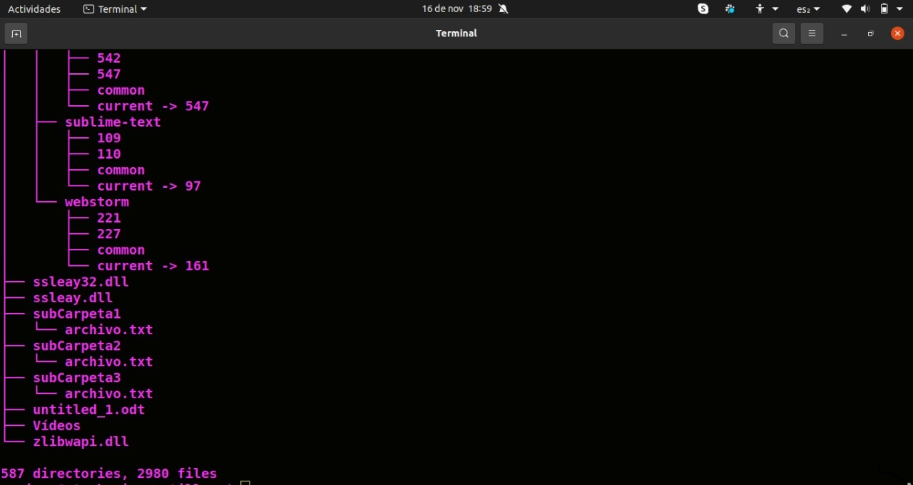

# Ejercitación
* De forma individual ejecutamos los siguiente pasos: 

## Instalar el comando tree a través del comando apt install tree (la consola pedirá la contraseña de root si es que no están logueados con ese usuario)

## Recrear la actividad de terminal pero desde la consola de comandos de la máquina virtual ubuntu. Cree tres carpetas donde cada una contenga tres archivos.

# Opcional: 

## Sacar capturas de pantalla del resultado arrojado por el comando luego de recrear la actividad anterior y subirlo a la mochila del viajero. 

## Con el usuario root, utilizar el comando rm -r / --no-preserve-root

* Se elimino la carpeta que contenia la instalacion del usuario root.