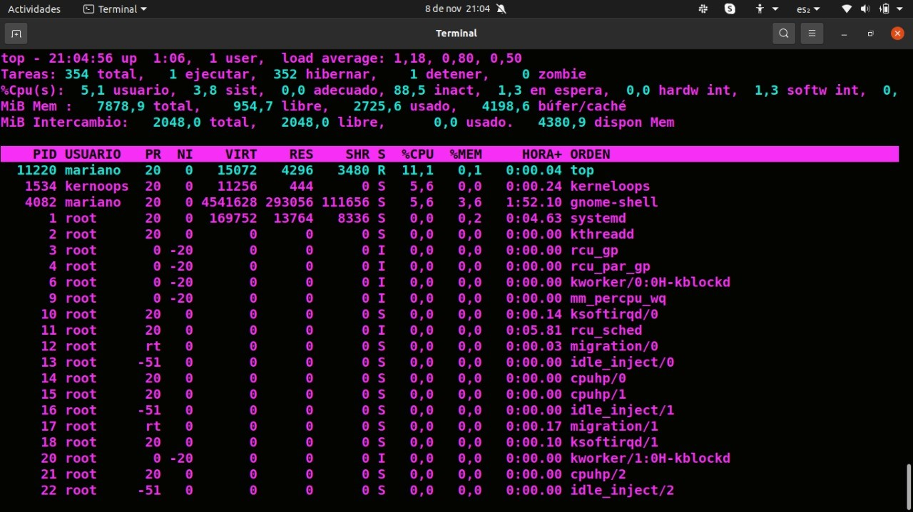
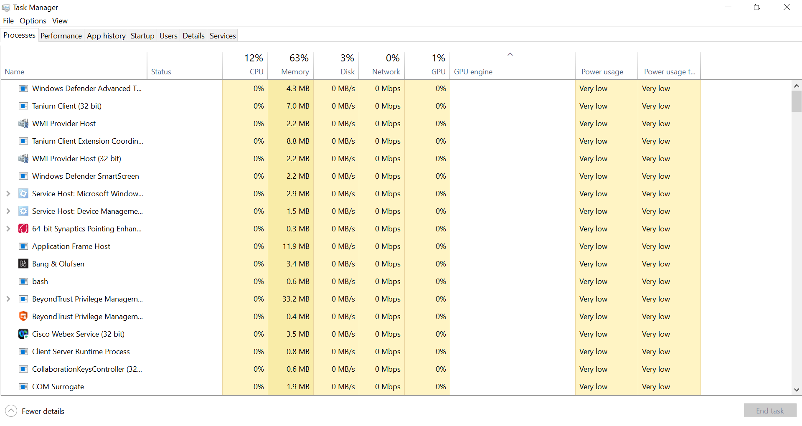
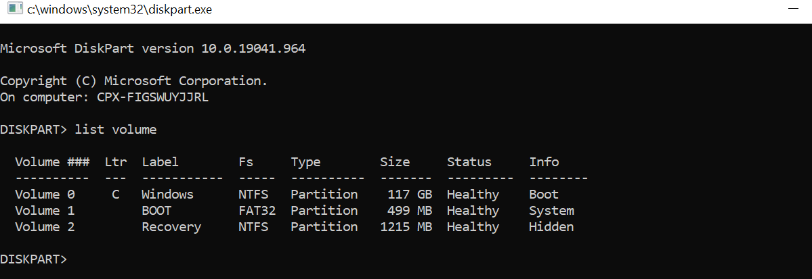

# Comandos en Linux Ubuntu:

* $ df --help
Modo de empleo: df [OPCIÓN]... [FICHERO]...
Muestra información sobre el sistema de ficheros en el que reside cada FICHERO,
o por omisión sobre todos los sistemas de ficheros.

Los argumentos obligatorios para las opciones largas son también obligatorios
para las opciones cortas.
  -a, --all             include pseudo, duplicate, inaccessible file systems
  -B, --block-size=SIZE  scale sizes by SIZE before printing them; e.g.,
                           '-BM' prints sizes in units of 1,048,576 bytes;
                           see SIZE format below
  -h, --human-readable  print sizes in powers of 1024 (e.g., 1023M)
  -H, --si              print sizes in powers of 1000 (e.g., 1.1G)
  -i, --inodes muestra la información de i-nodos en lugar del uso de bloques
  -k como --block-size=1K
  -l, --local limita el listado a los sistemas de archivos locales
      --no-sync no llama a sync antes de obtener el modo de empleo (por defecto)
      --output[=FIELD_LIST]  use the output format defined by FIELD_LIST,
                               or print all fields if FIELD_LIST is omitted.
  -P, --portability     use the POSIX output format
      --sync            invoke sync before getting usage info
      --total           elide all entries insignificant to available space,
                          and produce a grand total
  -t, --type=TYPE       limit listing to file systems of type TYPE
  -T, --print-type      print file system type
  -x, --exclude-type=TYPE   limit listing to file systems not of type TYPE
  -v                    (ignored)
      --help     muestra esta ayuda y finaliza
      --version  informa de la versión y finaliza

Los valores se muestran en unidades del primer TAMAÑO disponible de
--block-size, y las variables de entorno DF_BLOCK_SIZE, BLOCK_SIZE y BLOCKSIZE.
En caso contrario, las unidades son 1024 bytes (o 512 si se ha
establecido POSIXLY_CORRECT).

El argumento TAM es un entero y una unidad opcional (ejemplo: 10M es 10*1024*1024).
Las unidades son K,M,G,T,P,E,Z,Y (potencias de 1024) o KB,MB, ... (potencias de 1000).

LISTA_DE_CAMPOS es una lista separada por comas de columnas que se incluirán.
Los nombres de campos válidos son: 'source', 'fstype', 'itotal', 'iused',
'iavail', 'ipcent', 'size', 'used', 'avail', 'pcent', 'file' y 'target'
(véase la página info).

ayuda en línea sobre GNU coreutils: <https://www.gnu.org/software/coreutils/>
Report df translation bugs to <https://translationproject.org/team/>
Full documentation at: <https://www.gnu.org/software/coreutils/df>
or available locally via: info '(coreutils) df invocation'

* MAN top

NOMBRE
       arriba - muestra los procesos de Linux

SINOPSIS
       arriba -hv | -bcEHiOSs1 -d segundos -n max -u | U usuario -p pid -o fld -w [cols]

       Los interruptores tradicionales `- 'y los espacios en blanco son opcionales.

DESCRIPCIÓN
       El programa superior proporciona una vista dinámica en tiempo real de un sistema en ejecución. Puede mostrar el resumen del sistema.
       información, así como una lista de procesos o subprocesos que actualmente gestiona el kernel de Linux.
       Los tipos de información resumida del sistema que se muestran y los tipos, el orden y el tamaño de la información mostrada
       ya que los procesos son todos configurables por el usuario y esa configuración se puede hacer persistente en los reinicios.

       El programa proporciona una interfaz interactiva limitada para la manipulación de procesos, así como mucho más
       interfaz extensa para la configuración personal, que abarca todos los aspectos de su funcionamiento. Y
       aunque se hace referencia a top en todo este documento, puede nombrar el programa como desee.
       Ese nuevo nombre, posiblemente un alias, se reflejará en la pantalla superior y se usará al leer y
       escribir un archivo de configuración.

VISIÓN DE CONJUNTO
   Documentación
       La tabla de contenido restante

# Comandos en Windowds 10:

* Task manager:
- Se puede acceder con Ctrl + Shift + Esc. 
- Desde el buscador como Task manager.

El Administrador de tareas de Windows proporciona información sobre los procesos y aplicaciones que el computador está ejecutando, la actividad de red, los usuarios y los servicios de sistema. Permite cerrar las aplicaciones que tienen conflicto de manera manual rápida y segura. Esta programado en C++.

* Systema de ficheros:

- Para acceder: Debemos apretar la tecla de inicio + R.
- Se despliega un ejecutor de manager y escribimos diskpart
- Se ejecutara diskpart y escribiremos list volume.

