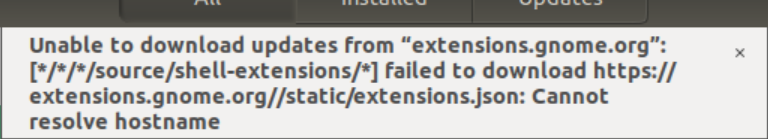
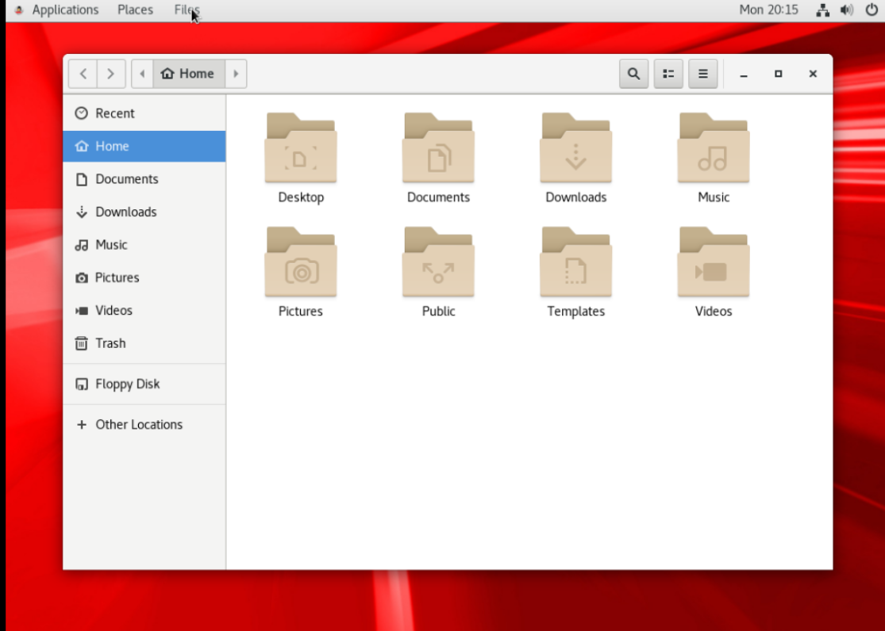

# Descripción del SO ORACLE LINUX

* ¿Es open source o con licencia?
Es open sourse ya que es una de las 256 distribusiones que tiene linux.

* ¿Cuales son los recursos de Hard que tiene la MV? Si no se pueden ver, buscar requisitos mínimos en internet.
Una VM es un software utilizado para simular un sistema operativo “invitado” que utiliza los recursos de hardware de un sistema host subyacente. Este sistema invitado se comporta como un PC independiente con RAM, espacio en el disco duro y sistema de archivos propios.

* ¿Cómo se accede a la ventana de comandos?
con click derecho, desde el panel de aplicaciones o ctrl t

* ¿Puedo instalar aplicaciones?¿Por que?
Si se puede instalar aplicaciones porque es open sourse.
Ademas OnWorks Oracle Linux online es una distribución de Linux de clase empresarial compatible con Oracle y construida a partir de paquetes fuente para Red Hat Enterprise Linux

* ¿Hay juegos instalados? 
No viene con juegos instalados.
Podemos acceder a Ubuntu Software Manager y si aparece <a href="https://docs.oracle.com/cd/E37876_01/html/E35459/grfiv.html">>

Solusión:

Instalado gnome-shell-extensions nuevamente

* sudo add-apt-repository ppa:gnome-shell-extensions/ppa
* sudo apt-get update
* sudo apt-get install gnome-shell-extensions
* Reinstalé la extensión de shell gnome en firefox, y después de un tiempo, comenzó a funcionar. Después de eso, Ubuntu Software Manager no mostró tal error

Capturar una imagen del file explorer (ejemplo)

<a href="https://docs.oracle.com/">>